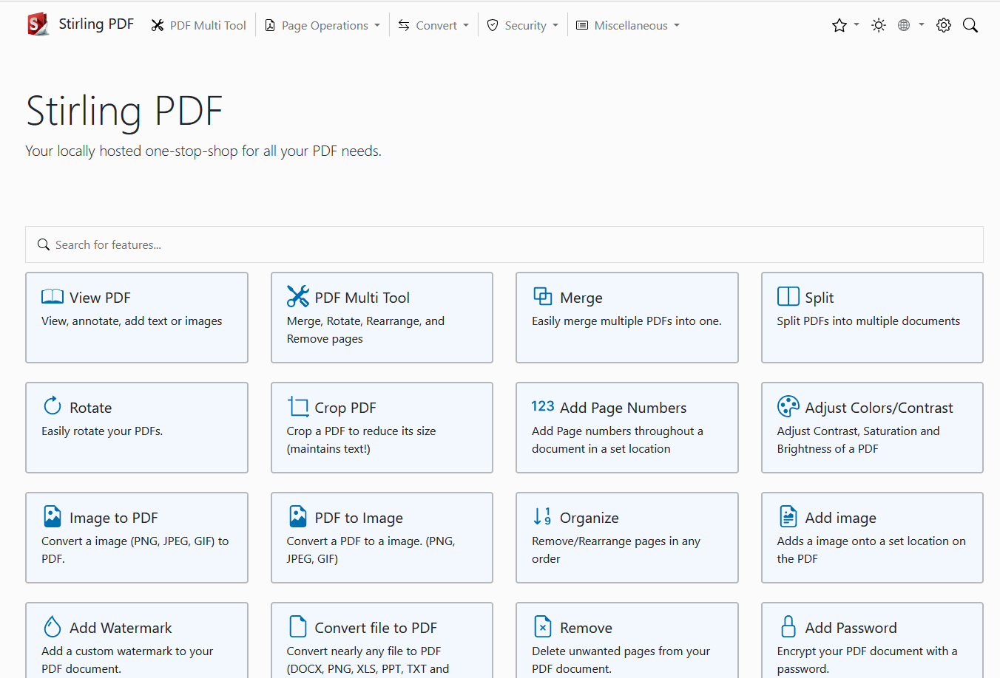
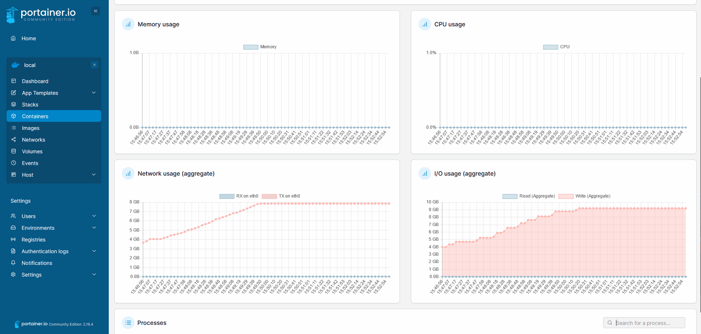
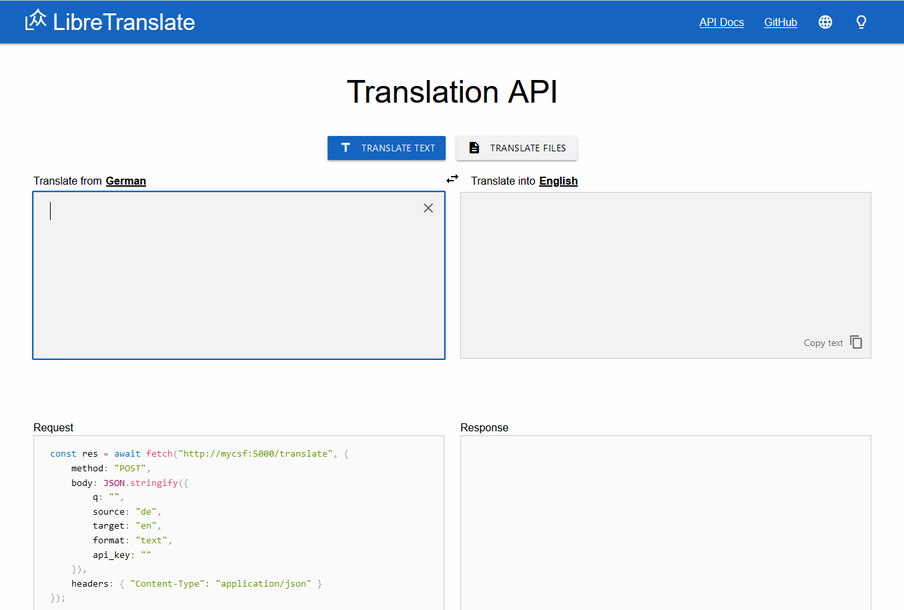
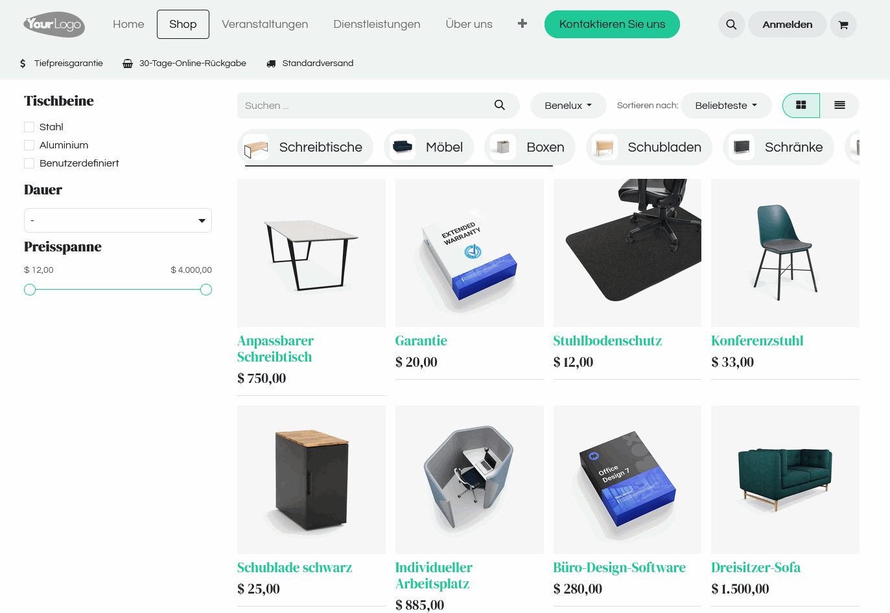

# B-Tocs Container Service Farm DPP

B-Tocs Container Service Farm based on Debian, Podman, Portainer.
This is a reference container host stack to demonstrate B-Tocss container scenarios.

## 3. Portainer stacks

### 3.1 Stop container spdf
- Login to portainer 
- Enter `container` section
- Stop container `spdf`

### 3.2 Install S-PDF as stack 

- Go to [S-PDF docker home](https://hub.docker.com/r/frooodle/s-pdf)
- Scroll to `Docker Compose`
- Copy the template

```yaml
version: '3.3'
services:
    s-pdf:
        ports:
            - '8080:8080'
        image: frooodle/s-pdf
```

- Log into portainer ui
- Go to `Stacks`
- Select `Add stack`
- Enter `spdf` as stack name
- Select option `Web editor`
- Paste the script
- Select `Deploy the stack` and wait
- See the new stack in area ´stack list´
- See a new container in the `Container` area
- See the same published port 8080

### 3.3 Port conflicts

- start the stopped container 'spdf'
- Understand the error 
- stop the stack spdf and start stack spdf again
- Understand the error
- delete container spdf
- prefer stacks
- reopen the page and see the Stirling PDF UI.



### 3.4 Install a stack with volumes

- This will configure a "LibreTranslate" stack - [see docker hub for more details](https://hub.docker.com/r/libretranslate/libretranslate)
- add a new stack `libre` with the following compose script

```yaml
version: "3"

networks:
  default:
    internal: true
  intern:
    external: true
  extern:
    external: true

volumes:
  libre_db:
  libre_home:

services:
  libre: 
    image: libretranslate/libretranslate:latest
    restart: unless-stopped
    networks:
      - intern
      - extern
    ports:
      - "5000:5000"
    expose:
      - "5000"
    environment:
      #- LT_DEBUG=True
      - LT_FRONTEND_LANGUAGE_SOURCE=de
      - LT_FRONTEND_LANGUAGE_TARGET=en
      #- LT_API_KEYS=True
    volumes:
      - libre_db:/app/db
      - libre_home:/home/libretranslate
```

- understand the parts networks, volumes and services
- Depoloy the new stack
- Try to open http://YOUR_IP:5000 - no success
- Go to portainer section `Container` select container `libre-libre-1`
- Select 'Stats' and wait a moment until the network usage has 8GB reached




- try to open http://YOUR_IP:5000 again
- Now the LibreTranslate UI should be visible



- Try to translate some text and/or files
- Enter portainer area `Volumes`
- Find two new volumes `libre*`
- Check the path information for later backup 


### 3.5 Stack with multiple containers

#### 3.5.1 Odoo stack
- This will configure a "Odoo 17" stack - [see docker hub for more details](https://hub.docker.com/_/odoo)
- add a new stack `odoo` with the following compose script
- use the following compose script

```yaml
version: '3'

networks:
  default:
    internal: true
  intern:
    external: true
  extern:
    external: true

volumes:
  odoo_web_data:
  odoo_web_config:
  odoo_web_addons:
  odoo_db_data:

services:
  db:
    image: postgres:16
    restart: unless-stopped    
    environment:
      - POSTGRES_DB=postgres
      - POSTGRES_USER=${POSTGRES_USER}
      - POSTGRES_PASSWORD=${POSTGRES_PASSWORD}
      - PGDATA=/var/lib/postgresql/data/pgdata
    volumes:
      - odoo_db_data:/var/lib/postgresql/data/pgdata
    networks:
      - default
    expose:
      - "5432"
    #ports:
    #  - "5432:5432"

  web:
    image: odoo:17
    restart: unless-stopped
    depends_on:
      - db
    environment:
      - HOST=db
      - USER=${POSTGRES_USER}
      - PASSWORD=${POSTGRES_PASSWORD}
    volumes:
      - odoo_web_data:/var/lib/odoo
      - odoo_web_config:/etc/odoo
      - odoo_web_addons:/mnt/extra-addons
    networks:
      - default
      - intern
      - extern
    expose:
      - "8069"
    ports:
      - "8069:8069"
```

- this script contains two services: the db and the webui of Odoo
- The stack will use an internal network "default" without publishing ports
- The webui use the additional external network "extern"
- The are some volumes declared for data persistence
- A new feature is to configure script variables by environment variables
    - Add a environment variable 'POSTGRES_USER' with a name: e.g. 'odoo'
    - Add another environment variable 'POSTGRES_PASSWORD' with a secret password: e.g. 'super-secret-password' (change it!) 
- Deploy the new stack and wait (for downloading new images)
- In the portainer container section two new container "odoo*" should occur
- container odoo-web-1 publish a port 8069
- try to open http://YOUR_IP:8069

#### 3.5.2 Odoo configuration

- Remember the master key and enter the required info for odoo installation
- Activate the flag demo data
- Create your new instance
- You can watch the log files from the odoo web ui container while installing
- After installing you see the odoo inside view
- in the top left menu you find the "Apps" feature
- Choose "Website" and follow the installation guide
- After installing logout and reopen as an anonymous web user


#### 3.5.3 Odoo Website

You have a opensource ERP installed with webseite, online shop and other useful things. Enjoy!


