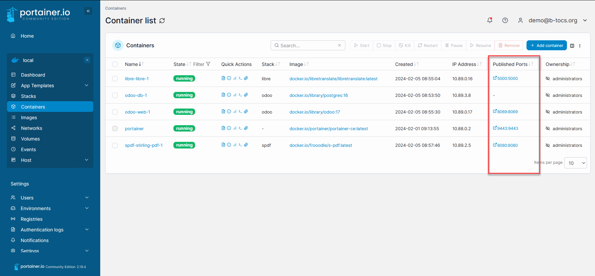
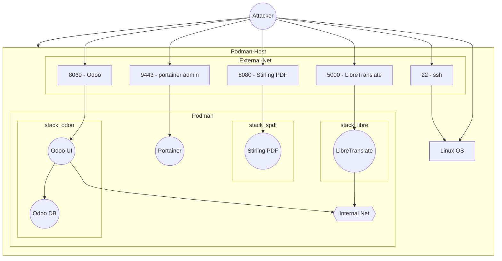
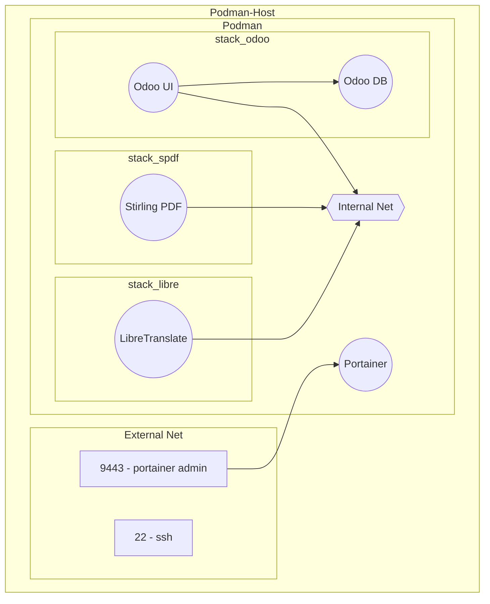
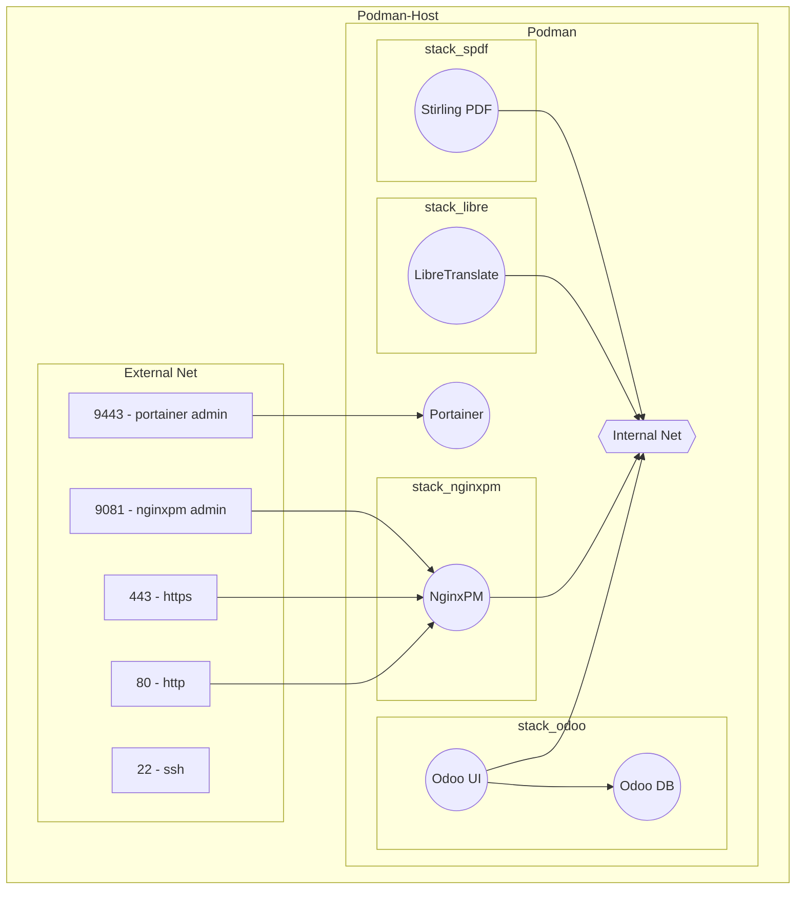
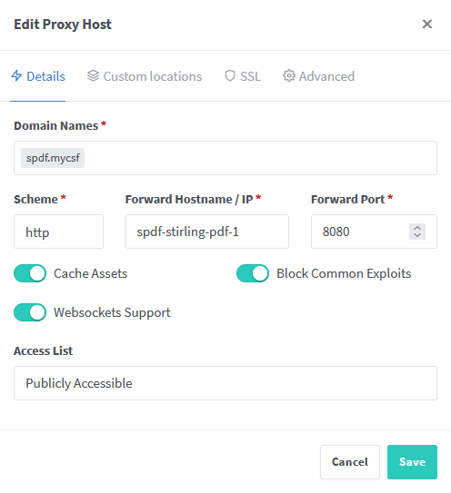
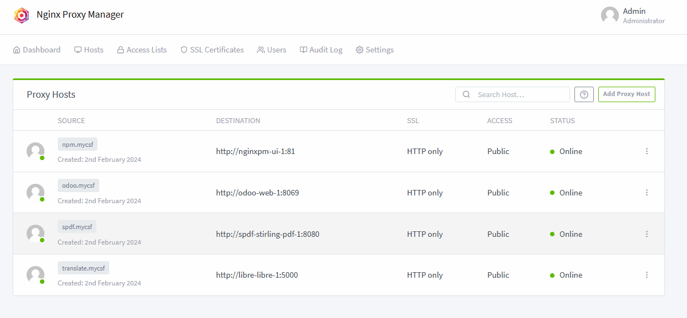
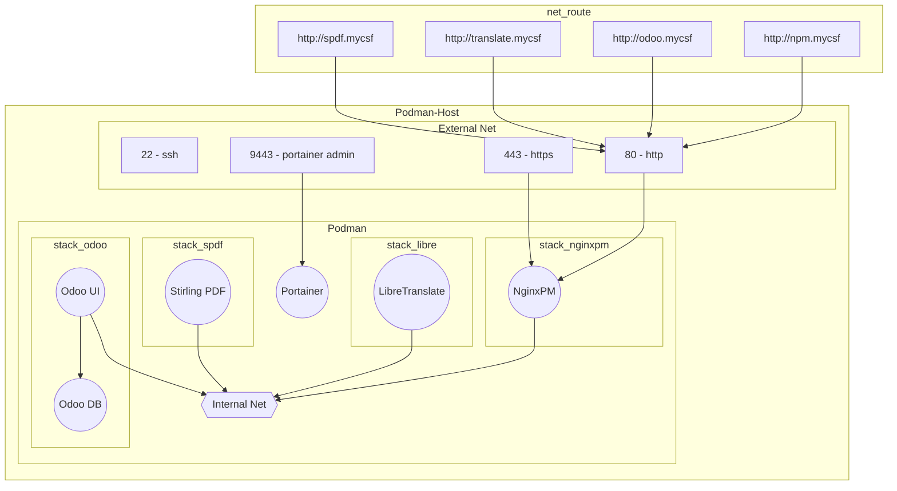
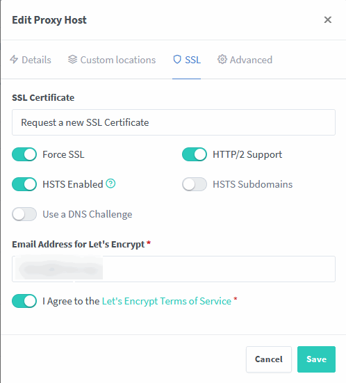
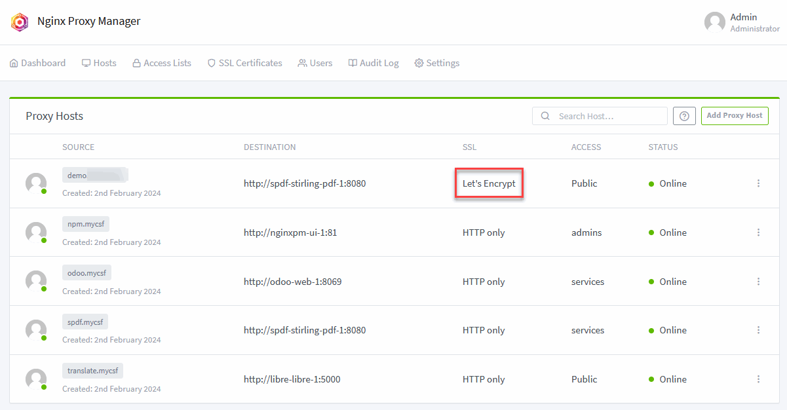
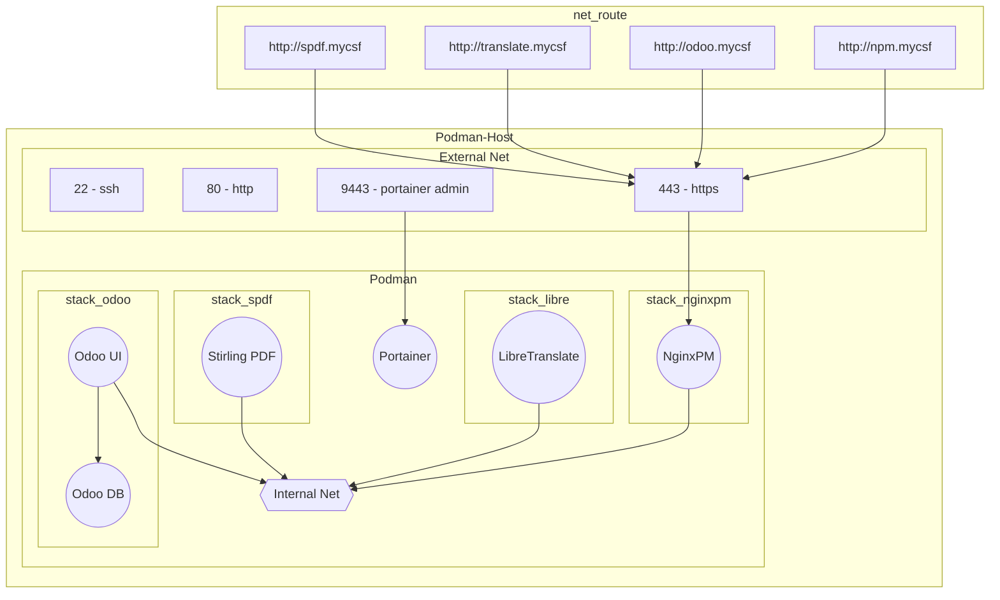

# B-Tocs Container Service Farm DPP

B-Tocs Container Service Farm based on Debian, Podman, Portainer.
This is a reference container host stack to demonstrate B-Tocss container scenarios.

## 4. Security

### 4.1 Published ports = Security risk



- Attackers can break in via port 22 or hardware access
- Portainer access is secured by an HTTPS connection, but weak passwords or errors in the Portainer software can allow attackers into the server
- In the current situation all containers have a direct HTTP connection to the internet
- HTTPS are not available, except for portainer
- Many possibilities for attackers...
- Most important activities: strong passwords and regular updates





### 4.2 Hide services ports

In this step the ports of the container services are hidden. In die next steps we build a new way to reach this ports.

#### 4.2.1 hide the s-pdf container

- Go to the portainer stack `spdf` and open the stack config
- The current config should be this:

```yaml
version: '3.3'
services:
  stirling-pdf:
    image: frooodle/s-pdf:latest
    ports:
      - '8080:8080'
    volumes:
      - /location/of/trainingData:/usr/share/tesseract-ocr/5/tessdata #Required for extra OCR languages
      - /location/of/extraConfigs:/configs
#      - /location/of/customFiles:/customFiles/
#      - /location/of/logs:/logs/
    environment:
      - DOCKER_ENABLE_SECURITY=false
```

- add the `networks` section at the beginning for the external network `intern`
- disable the service `ports` section 
- add a service `expose` section
- add a service `networks` section to link the container to the external defined network `intern`
- the new config should be this:

```yaml
version: '3.3'

networks:
  intern:
    external: true

services:
  stirling-pdf:
    image: frooodle/s-pdf:latest
    #ports:
    #  - '8080:8080'
    expose:
      - "8080"
    networks:
      - intern
    volumes:
      - /location/of/trainingData:/usr/share/tesseract-ocr/5/tessdata #Required for extra OCR languages
      - /location/of/extraConfigs:/configs
#      - /location/of/customFiles:/customFiles/
#      - /location/of/logs:/logs/
    environment:
      - DOCKER_ENABLE_SECURITY=false
```

- deploy the changes
- see the portainer container list: there are no published ports for the container `spdf-stirling-pdf-1`

#### 4.2.2 hide the s-pdf container

- Go to the portainer stack `libre` and open the stack config
- The current config should be this:

```yaml
version: "3"

networks:
  default:
    internal: true
  intern:
    external: true
  extern:
    external: true

volumes:
  libre_db:
  libre_home:

services:
  libre: 
    image: libretranslate/libretranslate:latest
    restart: unless-stopped
    networks:
      - intern
      - extern
    ports:
      - "5000:5000"
    expose:
      - "5000"
    environment:
      #- LT_DEBUG=True
      - LT_FRONTEND_LANGUAGE_SOURCE=de
      - LT_FRONTEND_LANGUAGE_TARGET=en
      #- LT_API_KEYS=True
    volumes:
      - libre_db:/app/db
      - libre_home:/home/libretranslate
```

- The service is already linked to the external networks: `intern` and `extern`
- The external network is required for downloading machine learning files
- disable the service `ports` section to hide port `5000`
- the new config should be this:

```yaml
version: "3"

networks:
  default:
    internal: true
  intern:
    external: true
  extern:
    external: true

volumes:
  libre_db:
  libre_home:

services:
  libre: 
    image: libretranslate/libretranslate:latest
    restart: unless-stopped
    networks:
      - intern
      - extern
    #ports:
    #  - "5000:5000"
    expose:
      - "5000"
    environment:
      #- LT_DEBUG=True
      - LT_FRONTEND_LANGUAGE_SOURCE=de
      - LT_FRONTEND_LANGUAGE_TARGET=en
      #- LT_API_KEYS=True
    volumes:
      - libre_db:/app/db
      - libre_home:/home/libretranslate
```

- deploy the changes
- see the portainer container list: there are no published ports for the container `libre-libre-1`

#### 4.2.3 hide the odoo containers

- Go to the portainer stack `odoo` and open the stack config
- The current config should be this:

```yaml
version: '3'

networks:
  default:
    internal: true
  intern:
    external: true
  extern:
    external: true

volumes:
  odoo_web_data:
  odoo_web_config:
  odoo_web_addons:
  odoo_db_data:

services:
  db:
    image: postgres:16
    restart: unless-stopped    
    environment:
      - POSTGRES_DB=postgres
      - POSTGRES_USER=${POSTGRES_USER}
      - POSTGRES_PASSWORD=${POSTGRES_PASSWORD}
      - PGDATA=/var/lib/postgresql/data/pgdata
    volumes:
      - odoo_db_data:/var/lib/postgresql/data/pgdata
    networks:
      - default
    expose:
      - "5432"
    #ports:
    #  - "5432:5432"

  web:
    image: odoo:17
    restart: unless-stopped
    depends_on:
      - db
    environment:
      - HOST=db
      - USER=${POSTGRES_USER}
      - PASSWORD=${POSTGRES_PASSWORD}
    volumes:
      - odoo_web_data:/var/lib/odoo
      - odoo_web_config:/etc/odoo
      - odoo_web_addons:/mnt/extra-addons
    networks:
      - default
      - intern
      - extern
    expose:
      - "8069"
    ports:
      - "8069:8069"
```

- The service `db` is only linked to an own network `default` and publish no ports 
- The service `web` is already linked to the external networks: `defdault`, `intern` and `extern`
- The external network is required for downloading odoo extensions and updates - this is outbound traffic and allowed
- Direct inbound network traffic to the odoo service should be blocked
- disable the service `ports` section to hide port `5000`
- the new config should be this:

```yaml
version: '3'

networks:
  default:
    internal: true
  intern:
    external: true
  extern:
    external: true

volumes:
  odoo_web_data:
  odoo_web_config:
  odoo_web_addons:
  odoo_db_data:

services:
  db:
    image: postgres:16
    restart: unless-stopped    
    environment:
      - POSTGRES_DB=postgres
      - POSTGRES_USER=${POSTGRES_USER}
      - POSTGRES_PASSWORD=${POSTGRES_PASSWORD}
      - PGDATA=/var/lib/postgresql/data/pgdata
    volumes:
      - odoo_db_data:/var/lib/postgresql/data/pgdata
    networks:
      - default
    expose:
      - "5432"
    #ports:
    #  - "5432:5432"

  web:
    image: odoo:17
    restart: unless-stopped
    depends_on:
      - db
    environment:
      - HOST=db
      - USER=${POSTGRES_USER}
      - PASSWORD=${POSTGRES_PASSWORD}
    volumes:
      - odoo_web_data:/var/lib/odoo
      - odoo_web_config:/etc/odoo
      - odoo_web_addons:/mnt/extra-addons
    networks:
      - default
      - intern
      - extern
    expose:
      - "8069"
    #ports:
    #  - "8069:8069"
```

- deploy the changes
- see the portainer container list: there are no published ports for the container `odoo-web-1`


#### 4.2.5 New port status

- All ports of the services are deactivated now
- There are no way to reach the tack services from the outside 




## 4.3 Nginx Proxy Manager

### 4.3.1 Prepare domain names

- For the next steps a name resolution is required
- The best option is an external or internal DNS and new hostnames for the our services
- The following names are required: spdf, translate, odoo, npm
- As a workaround the local hosts file can be changed to sinmulate DNS resolution

#### Workaround Windows local hosts
- The windows hosts file is located in C:\Windows\System32\drivers\etc
- Modify this file as administrator and add a few lines at the end

```cfg
# B-Tocs Container Service Farm Demo
<your_ip>	  mycsf
<your_ip>		translate.mycsf
<your_ip>		spdf.mycsf
<your_ip>		odoo.mycsf
<your_ip>		npm.mycsf 
```

<yourip> has to be replaced with the IP of your server, e.g. "192.168.0.100".


### 4.3.2 New stack 'nginxpm' for Nginx Proxy Manager
- Go to [NginxPM docker home](https://hub.docker.com/r/jc21/nginx-proxy-manager)
- Login to portainer 
- Add a new portainer stack `nginxpm`
- Copy the following compose template and paste it to your stack

```yaml
version: "3"

networks:
  default:
    internal: true
  intern:
    external: true
  extern:
    external: true

volumes:
  nginxpm_data:
  nginxpm_letsencrypt: 

services:
  ui:
    image: jc21/nginx-proxy-manager
    restart: unless-stopped
    networks:
      - intern
      - extern
    ports:
      - "80:80"
      - "443:443"
      - "9081:81"
    expose:
      - "80"
      - "81"
      - "443" 
    volumes:
      - nginxpm_data:/data
      - nginxpm_letsencrypt:/etc/letsencrypt 
```

- Deploy the stack
- The new stack has two new volumes "nginxpm*" relevant for backup
- See the new stack and the published ports 80, 443, 9081
- Go to portainer container section and see all open ports



- From a theoretical point of view there is a way from the outside internet to the stack services through the NginxPM container
- NginxPM is a reverse proxy and works as a firewall - without configuration no access

### 4.3.3 First Login to NginxPM

- The setup information for the Nginx Proxy Manager can be found [here](https://nginxproxymanager.com/setup/)
- Open http://<yourip>:9081 or http://mycsf:9081 with a web browser
- Enter `admin@example.com` as email address and `changeme` for password
- In the following popup enter at least a new email
- In the next popup "Change Password" enter `changeme` as old password and a strong new password
- Save
- Go to `Settings` and change "Default Site" to optio2 "404 plibre


### 4.3.3 First Login to NginxPM

- The setup information for the Nginx Proxy Manager can be found [here](https://nginxproxymanager.com/setup/)
- Open http://<yourip>:9081 or http://mycsf:9081 with a web browser
- Enter `admin@example.com` as email address and `changeme` for password
- In the following popup enter at least a new email
- In the next popup "Change Password" enter `changeme` as old password and a strong new password
- Save
- Go
        
### 4.3.4 Add proxy hosts for serviceshttp://translate.mycsf/

#### 4.3.4.1 Stack spdf

- Within the NginxPM UI to to "Hosts" and "Proxy Hosts"
- Select "Add Proxy Host"
- Enter the following information in area "Details"




|Field                    | Value                | Remarks                                  |
| ----                    | ----                 | ----                                     |
| Domain Names            | spdf.mycsf           | depends on 4.3.1, use your name instead  |
| Schheme                 | http                 |                                          |
| Forward Hostname / IP   | spdf-stirling-pdf-1  | = the hostname of the container          |
| Forward Port            | 8080                 | = the exposed port of the container      |
| Cache Assets            | activated            | optional                                 |
| Block Common Exploits   | activated            | optional                                 |
| Websockets support      | activated            | optional                                 | 
| Access List             | Publicity Accessible | can be changed later                     |

- Open http://spdf.mycsf/ or your dns name for spdf service in a browser
- The Stirling PDF UI should appear.


#### 4.3.4.2 Stack libre

- Within the NginxPM UI to to "Hosts" and "Proxy Hosts"
- Select "Add Proxy Host"
- Enter the following information in area "Details"

|Field                    | Value                | Remarks                                  |
| ----                    | ----                 | ----                                     |
| Domain Names            | translate.mycsf      | depends on 4.3.1, use your name instead  |
| Schheme                 | http                 |                                          |
| Forward Hostname / IP   | libre-libre-1        | = the hostname of the container          |
| Forward Port            | 5000                 | = the exposed port of the container      |
| Cache Assets            | activated            | optional                                 |
| Block Common Exploits   | activated            | optional                                 |
| Websockets support      | activated            | optional                                 | 
| Access List             | Publicity Accessible | can be changed later                     |

- Open http://translate.mycsf  or your dns name for libre service in a browser
- The LibreTranslate UI should appear


#### 4.3.4.3 Stack odoo

- Within the NginxPM UI to to "Hosts" and "Proxy Hosts"
- Select "Add Proxy Host"
- Enter the following information in area "Details"

|Field                    | Value                | Remarks                                  |
| ----                    | ----                 | ----                                     |
| Domain Names            | odoo.mycsf           | depends on 4.3.1, use your name instead  |
| Schheme                 | http                 |                                          |
| Forward Hostname / IP   | odoo-web-1           | = the hostname of the container          |
| Forward Port            | 8069                 | = the exposed port of the container      |
| Cache Assets            | activated            | optional                                 |
| Block Common Exploits   | activated            | optional                                 |
| Websockets support      | activated            | optional                                 | 
| Access List             | Publicity Accessible | can be changed later                     |

- Open http://odoo.mycsf  or your dns name for odoo service in a browser
- The Odoo website should appear


#### 4.3.4.3 Stack nginxpm

- Within the NginxPM UI to to "Hosts" and "Proxy Hosts"
- Select "Add Proxy Host"
- Enter the following information in area "Details"

|Field                    | Value                | Remarks                                  |
| ----                    | ----                 | ----                                     |
| Domain Names            | npm.mycsf            | depends on 4.3.1, use your name instead  |
| Schheme                 | http                 |                                          |
| Forward Hostname / IP   | nginxpm-ui-1         | = the hostname of the container          |
| Forward Port            | 81                   | = the exposed port of the container      |
| Cache Assets            | activated            | optional                                 |
| Block Common Exploits   | activated            | optional                                 |
| Websockets support      | activated            | optional                                 | 
| Access List             | Publicity Accessible | can be changed later                     |

- Open http://npm.mycsf  or your dns name for odoo service in a browser
- The Nginx Proxy Manager Login should appear

#### 4.3.4.4 Configured names




### 4.3.5 Hide port 9081

The port 9081 of nginxpm is unsaecure because without SSL/HTTPS. With the route via the nginxpm itself "http://npm.mycsf" an alternative route exists. 

This is unsecure too but the exacts name must be known for correct routing. In a later step the access to npm can be switched to https.

In this optional step the port 9081 will be disabled and can be enabled again by modifying the portainer stack config.

- Go to the portainer stack `nginxpm` and deactiviate port 9081
- Deploy the stack and check if port 9081 is hidden

The stack config should be:

```yaml
version: "3"

networks:
  default:
    internal: true
  intern:
    external: true
  extern:
    external: true

volumes:
  nginxpm_data:
  nginxpm_letsencrypt: 

services:
  ui:
    image: jc21/nginx-proxy-manager
    restart: unless-stopped
    networks:
      - intern
      - extern
    ports:
      - "80:80"
      - "443:443"
      #- "9081:81"
    expose:
      - "80"
      - "81"
      - "443" 
    volumes:
      - nginxpm_data:/data
      - nginxpm_letsencrypt:/etc/letsencrypt 
```

### 4.3.5 Active port and service status

The services are available now through the Nginx Proxy Manager and the http://npm.mycsf URL. 



## 4.4 Securing NginxPM

### 4.4.1 Access lists

Access lists are an additional authorization layer. This adds "Basic Authentification" to the proxy host.

#### 4.4.1.1 Maintain access list for services 

- Go to the NginxPM UI 
- Select `Add Access List`
- Enter `services` as name and activate `Satisfy Any` 
- Go to area `Authorization` and enter an user + password like `demo` 
- Save


#### 4.4.1.2 Secure the Odoo service with access lists

- Go to the NginxPM UI 
- Select `Hosts` -> `Proxy Hosts`
- Edit the `odoo.mycsf´ proxy host entry
- Select `services` for `Access List`
- Save
- Open the `http://odoo.mycsf` in another browser
- A popup for entering `demo` + your password occurs

### 4.4.2 Adding HTTPS/SSL

The following steps are only available with an external domain. The free service [Let's encrypt](https://letsencrypt.org) is used here. There are workarounds available to get the certificates for internal domains too but this is not documented here.

You will need a domain like `demo.yourdomain.com`.


- Go to the NginxPM UI
- Add a new proxy host for a service, e.g. the spdf like before except field `Domain Names`
- Add your domain `demo.yourdomain.com` here instead of the former internal name
- Go to area `SSL`
- Select `Request a new SSL Certificate` in `SSL Certificate`
- Activate: `Force SSL`, `HTTP/2 support`, `HSTS enabled` and `I Agree to...`



- Press Save and wait
- After a while the new entry should be appear as new proxy host in the list and with `Let's Encrypt` in column `SSL` instead of `HTTP only`
- Open a browser and open `http://demo.yourdomain.com` 
- You should see your service and the browser should be switched to https automatically
- The browser should display a valid certificate

### 4.4.3 Current port status



Now your container farm supports HTTPS. If you modify all proxy hosts to SSL support, the port 80 will be forwarded to the HTTPS port 443. 





## 4.5 Further security issues

There are some more activities to securing the server. 

Some ideas:
- Install podman rootless - [see more](https://github.com/containers/podman/blob/main/docs/tutorials/rootless_tutorial.md)
- Do not use the root user to administrate the server - use an own user with sudo - [see more](https://www.cloudpanel.io/tutorial/how-to-add-user-to-sudoers-in-debian/)
- Use ssh with public keys for other sudo users - [see more](https://www.digitalocean.com/community/tutorials/how-to-set-up-ssh-keys-on-debian-11)
- Use a firewall on the server - [see more](https://www.cyberciti.biz/faq/set-up-a-firewall-with-ufw-on-debian-12-linux/)
- Use a external firewall of your hosting partner (depends on your environment)

If you have further ideas contribute to this project. Thanks!